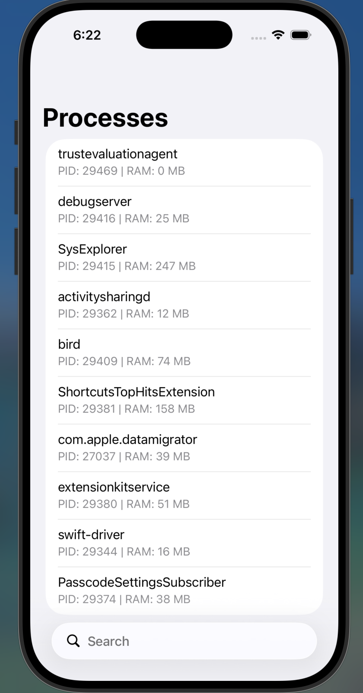

# 🚧 v2 research toolkit 

# SysExplorer

iOS system monitor and internals explorer. Installs via TrollStore with extended entitlements.

<p align="center">
  
</p>

## Features

### Stage 1 — Process List ✅
- Real-time list of all running processes
- PID, process name, RAM usage, thread count
- Search and pull-to-refresh
- Powered by `proc_listallpids` + `proc_pidinfo` (C system calls)

### Stage 2 — Process Detail ✅
- Open file descriptors via `proc_pidinfo(PROC_PIDLISTFDS)`
- Entitlements via `csops`
- Binary path and thread count

### Stage 3 — Mach-O Inspector ✅
- Architecture, file type (Executable / dylib / bundle)
- Segments: `__TEXT`, `__DATA`, `__LINKEDIT`, etc.
- Linked libraries list
- Powered by `mmap` + manual Mach-O header parsing in C++

### Stage 4 — XPC Explorer ✅
- Scans `/System/Library/LaunchDaemons/`
- Parses plists and lists all MachServices
- Background loading

### Stage 5 — IOKit Browser ✅
- Full IOKit registry traversal up to 3 levels deep
- Shows name and class of every IOService
- Indented hierarchy view

## Roadmap — v2 Research Toolkit

Evolving SysExplorer from a viewer into a **research toolkit** for spotting anomalies
and attack surface on iOS. Still read-only, no process modification — see
[Disclaimer](#disclaimer).

- [ ] **XPC Interface Enumerator** — extract exported XPC methods per MachService by
  parsing daemon binaries (`__TEXT.__text`, `LC_SYMTAB`, `__cstring`), map methods to
  required client entitlements
- [ ] **Entitlement Diff Tool** — compare entitlements between two processes, highlight
  `com.apple.private.*`, export diff as JSON
- [ ] **Snapshot & Compare** — save full system state (processes, IOKit registry,
  MachServices) to SQLite, diff two snapshots (new / gone / changed)
- [ ] **Anomaly Heuristics Engine** — flag suspicious patterns: high-RAM zero-thread
  processes, ghost processes, orphan IOServices, suspicious entitlement combos, XPC
  services without client checks, load command anomalies
- [ ] **Export to JSON/CSV** on every screen
- [ ] **URL scheme** `sysexplorer://` for linking directly to processes, IOKit nodes,
  XPC services, and snapshots

## Stack

- **UI**: Swift + UIKit
- **System layer**: Objective-C + C/C++
- **Build**: Xcode, iOS 15.0+, arm64

## Requirements

- iPhone/iPad with [TrollStore](https://github.com/opa334/TrollStore) installed
- iOS 15.0+

## Installation

1. Download `SysExplorer.tipa` from [Releases](../../releases)
2. Open with TrollStore
3. Install

## Entitlements

```xml
<key>task_for_pid-allow</key>
<true/>
<key>com.apple.private.security.no-sandbox</key>
<true/>
<key>platform-application</key>
<true/>
<key>com.apple.private.security.no-container</key>
<true/>
```

## Disclaimer

Read-only exploration tool. Does not modify process memory or inject code.
